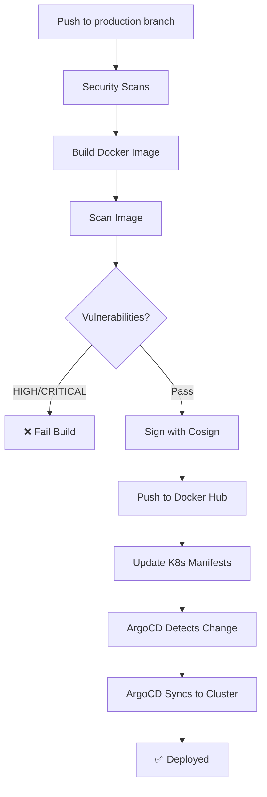

# ✅ Updated CI/CD Configuration Summary

## 🎯 Key Changes Made

### 1. **Deployment Trigger**
- ✅ **Changed**: Now triggers **only on `production` branch**
- ❌ **Removed**: `main` and `develop` branch triggers
- **Why**: Maximum security and control - only production deployments

### 2. **Container Registry**
- ✅ **Changed**: Push to **Docker Hub** instead of GitHub Container Registry (GHCR)
- **Configuration**: Uses `DOCKER_HUB_USERNAME`, `DOCKER_HUB_TOKEN`, `DOCKER_HUB_REPOSITORY`
- **Image format**: `username/repository:prod-{sha}-{timestamp}`

### 3. **ArgoCD Integration**
- ✅ **Confirmed**: ArgoCD runs on **separate server** (not created by this pipeline)
- ✅ **Integration**: Workflow updates K8s manifests → ArgoCD auto-syncs
- ✅ **Optional trigger**: Can trigger manual ArgoCD sync via API (if tokens configured)
- **No setup needed**: Your existing ArgoCD handles deployment

### 4. **Enhanced Security**
- ✅ **Image signing**: Added Cosign keyless signing
- ✅ **Stricter scanning**: Fail build on HIGH/CRITICAL vulnerabilities
- ✅ **Enhanced notifications**: Better Slack formatting + email on failures
- ✅ **Detailed commit messages**: Full deployment info in K8s repo commits

## 📋 New GitHub Secrets Required

Update your repository secrets (**Settings** → **Secrets and variables** → **Actions**):

### Docker Hub (Required)
```
DOCKER_HUB_USERNAME      # Your Docker Hub username
DOCKER_HUB_TOKEN         # Access token from hub.docker.com
DOCKER_HUB_REPOSITORY    # Format: username/repository-name
```

### Kubernetes (Required)
```
K8S_REPO_NAME           # Your K8s manifests repo (org/repo-name)
K8S_REPO_PAT            # GitHub PAT with 'repo' scope
```

### Notifications (Optional)
```
SLACK_WEBHOOK_URL       # Slack webhook for notifications
ARGOCD_AUTH_TOKEN       # ArgoCD token (for manual sync trigger)
ARGOCD_SERVER           # ArgoCD server URL
NOTIFICATION_EMAIL      # Email for failure alerts
```

📖 **Detailed instructions**: [GITHUB_SECRETS_SETUP.md](GITHUB_SECRETS_SETUP.md)

## 🔄 Updated Workflow Steps

### Security Scanning Job
- Trivy filesystem scan
- npm audit
- Upload results to GitHub Security tab

### Build & Push Job
1. Build multi-stage Docker image
2. Run Trivy + Grype vulnerability scans
3. **Fail build** if HIGH or CRITICAL vulnerabilities found
4. Generate SBOM
5. **Sign image with Cosign** (keyless)
6. Push to **Docker Hub**

### Update K8s Manifests Job
1. Clone K8s repository
2. Navigate to `overlays/production`
3. Update image tag using Kustomize
4. Create detailed commit message
5. Push changes (with `[skip ci]`)
6. **Optional**: Trigger ArgoCD sync via API

### Notification Job
- Enhanced Slack notifications with full details
- Email alerts on failures
- GitHub commit comments with deployment info

## 🚀 Deployment Flow



## 📁 Updated Files

### Workflow Files
- ✅ `.github/workflows/deploy.yml` - Updated for Docker Hub + production branch
- ✅ `.github/workflows/security-scan.yml` - No changes (already secure)

### Kubernetes Manifests
- ✅ `k8s-manifests/base/deployment.yaml` - Changed image to Docker Hub format
- ✅ `k8s-manifests/base/kustomization.yaml` - Changed image reference
- ✅ All overlay files remain compatible

### Documentation
- ✅ `DEPLOYMENT_GUIDE.md` - Updated for Docker Hub + ArgoCD
- ✅ `GITHUB_SECRETS_SETUP.md` - **NEW** - Complete secrets guide
- ✅ `QUICK_REFERENCE.md` - **NEW** - Quick reference guide
- ✅ `FILES_CREATED.md` - Updated summary
- ✅ `k8s-manifests/README.md` - Updated ArgoCD section
- ✅ `UPDATE_SUMMARY.md` - **THIS FILE**

## ✅ What You Need To Do

### Step 1: Configure Docker Hub (5 minutes)
1. Go to [hub.docker.com](https://hub.docker.com/)
2. Create repository: `onestop-backend`
3. Generate access token (Settings → Security)
4. Add secrets to GitHub:
   - `DOCKER_HUB_USERNAME`
   - `DOCKER_HUB_TOKEN`
   - `DOCKER_HUB_REPOSITORY`

### Step 2: Configure K8s Repository Access (3 minutes)
1. Create GitHub Personal Access Token with `repo` scope
2. Add secrets to GitHub:
   - `K8S_REPO_NAME`
   - `K8S_REPO_PAT`

### Step 3: Update K8s Manifests (5 minutes)
1. Update `k8s-manifests/base/deployment.yaml`:
   ```yaml
   image: your-dockerhub-username/onestop-backend:latest
   ```

2. Update `k8s-manifests/base/kustomization.yaml`:
   ```yaml
   images:
   - name: your-dockerhub-username/onestop-backend
     newTag: latest
   ```

3. Update domain names in ingress files

### Step 4: Verify ArgoCD Configuration (2 minutes)
Ensure your ArgoCD application is configured to:
- Watch your K8s manifests repository
- Monitor path: `overlays/production`
- Auto-sync enabled

### Step 5: Test Deployment (10 minutes)
```bash
# Push to production branch
git checkout production
git merge main  # or your main branch
git push origin production

# Monitor workflow
# Go to GitHub Actions tab

# Check ArgoCD dashboard
# Verify deployment in cluster
kubectl get pods -n production
```

## 🔐 Security Improvements

| Feature | Before | After |
|---------|--------|-------|
| Vulnerability Scan | Warning only | **Fails build on HIGH/CRITICAL** |
| Image Signing | ❌ No | ✅ Cosign keyless signing |
| Branch Control | main + develop | ✅ **production only** |
| Registry | GHCR | ✅ Docker Hub (industry standard) |
| ArgoCD Setup | In workflow | ✅ Separate server (better practice) |
| Notifications | Basic | ✅ Rich Slack + Email alerts |
| SBOM | Basic | ✅ Enhanced with attestations |

## 📊 Benefits

1. **Enhanced Security**: Image signing, stricter vulnerability checks
2. **Better Control**: Production-only deployments
3. **Industry Standard**: Docker Hub is widely used and trusted
4. **Separation of Concerns**: ArgoCD on separate infrastructure
5. **Better Notifications**: Detailed deployment status
6. **Comprehensive Docs**: Multiple guides for different needs

## 🆘 Troubleshooting

### Workflow fails at Docker Hub push
**Cause**: Invalid credentials or repository doesn't exist  
**Solution**: Verify Docker Hub secrets and create repository

### K8s manifest update fails
**Cause**: Invalid GitHub PAT or wrong repository name  
**Solution**: Check `K8S_REPO_PAT` has `repo` scope

### ArgoCD not syncing
**Cause**: ArgoCD not configured to watch repository  
**Solution**: Verify ArgoCD application configuration

### Image not found in cluster
**Cause**: Kustomize image name doesn't match Docker Hub repository  
**Solution**: Ensure image names match exactly

## 📚 Documentation Guide

- **Quick Start**: [QUICK_REFERENCE.md](QUICK_REFERENCE.md)
- **Secrets Setup**: [GITHUB_SECRETS_SETUP.md](GITHUB_SECRETS_SETUP.md)
- **Full Guide**: [DEPLOYMENT_GUIDE.md](DEPLOYMENT_GUIDE.md)
- **K8s Details**: [k8s-manifests/README.md](k8s-manifests/README.md)
- **This Summary**: [UPDATE_SUMMARY.md](UPDATE_SUMMARY.md)

## ✨ Ready to Deploy!

Everything is configured for production-grade, secure, industry-standard CI/CD:

✅ Security scanning at every step  
✅ Docker Hub integration  
✅ ArgoCD GitOps workflow  
✅ Production-only deployments  
✅ Image signing and SBOM  
✅ Comprehensive documentation  

**Next**: Follow [GITHUB_SECRETS_SETUP.md](GITHUB_SECRETS_SETUP.md) to configure secrets, then push to `production` branch!

---

**Questions?** Check the documentation files or open an issue.
